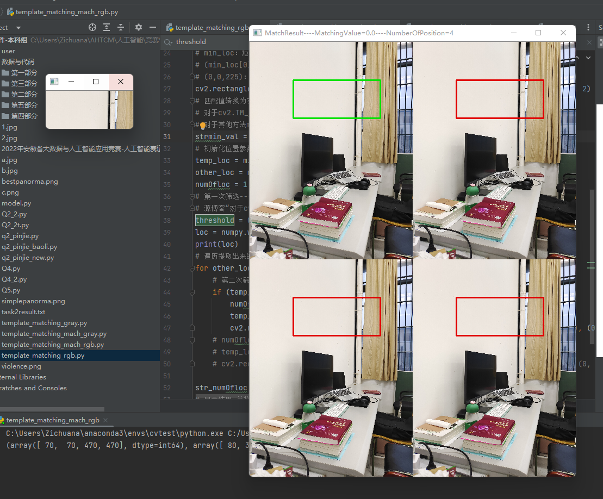

## Study Notes of Opencv
>杂乱无章的个人笔记  

### 图像拼接
`b.jpg`为主要图像，`a.jpg`为拼接图像。  
- 通过`Image_mosaic.py`进行拼接  
生成`simple-panorma.png`，`best-panorma.png`，后者为最终拼接结果。  
  
- 通过`Image_mosaic_new.py`进行拼接  
与上方法几乎一致，但是不会旋转拼接。  
  
- 通过`Image_mosaic_.py`进行暴力匹配  
生成结果如`violence.png`所示  
  
### 模板匹配
>单目标

- 转灰度匹配
`template_matching_gray.py`  
结果如图`tematch_gray.png`所示  
  
- RGB匹配
`template_matching_rgb.py`  
结果如图`tematch_rgb1.png`所示  
  
修改通道后如图`tematch_rgb2.png`所示  
 
>多目标

- 转灰度匹配
`template_matching_much_gray.py`  
结果如图`template_matching_much_gray.png`所示  
  
- RGB匹配
`template_matching_much_rgb.py`  
结果如图`template_matching_much_rgb.png`所示  
  
这里假设不做更改，按照copy来的源码进行展示如图`error.png`  
  
在当前的区域内，存在多个小于当前指定阈值`threshold`的情况，所以将它们都做了标记，需要对阈值`threshold`进行调整。  